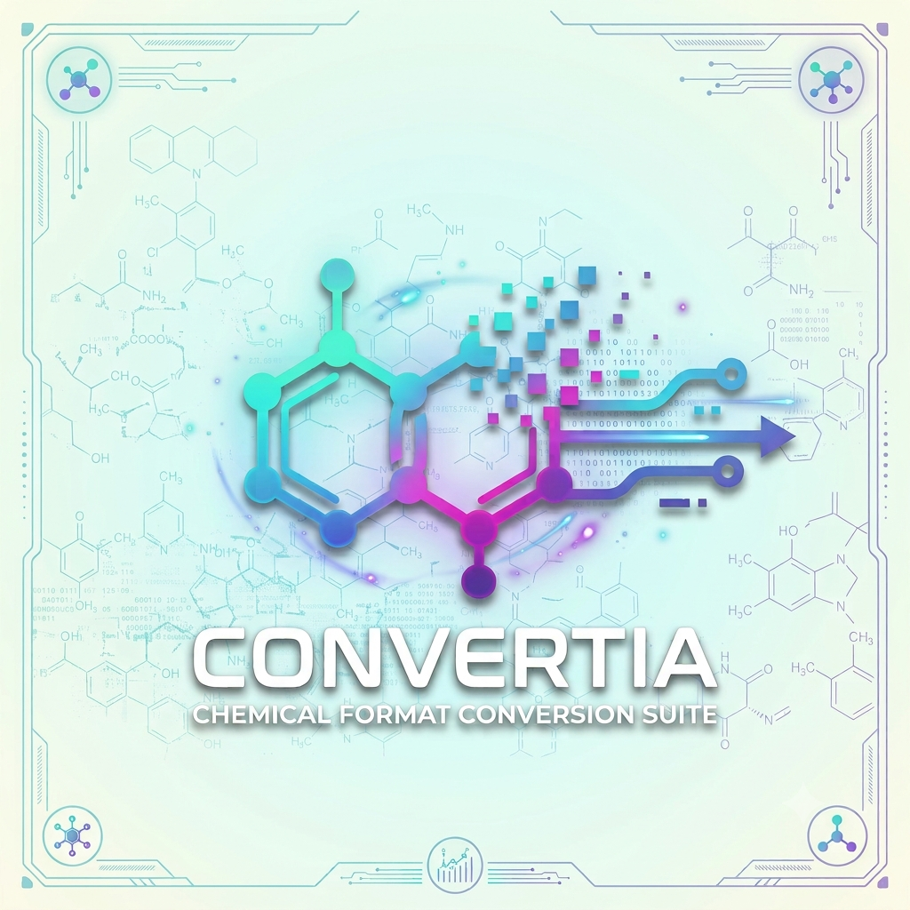

# Convertia



**Created by [Dr. Sameer Reddy Marri](https://sameer24688-jpg.github.io/SameerReddyM.github.io/#top)** · Postdoctoral Associate, Boston University · [Center for Molecular Discovery](https://www.bu.edu/cmd/about-the-bu-cmd/personnel/staff/)

**Stop losing your structural metadata.** Move from ChemDraw plates to analysis-ready datasets in one step.

**Convertia** is a specialized, zero-install utility for medicinal chemists and data curators. Standard format converters often treat ChemDraw exports as generic molecular files — stripping layout context, custom text, and plate metadata. Convertia is built to parse dense **SAR plates, compound libraries, and annotated screens** from **CDXML, CDX, SDF, and CSV**, and emit clean, fully populated **CSV** or **SDF** files that reflect the chemistry as drawn, enriched with pre-computed descriptors.

Powered by **RDKit** (structures and descriptors), **JPLogP** (computed `CLogP` lipophilicity), and ChemDraw-aware parsing (nickname expansion, `chemicalproperty` titles, coordinate-based labels).

**Free for the community.** Convertia is offered as a public research tool — not a commercial product. It exists because open-source cheminformatics (RDKit, CDK/JPLogP, Open Babel, and others) made it possible; the intent is to give that back to medicinal chemistry and SAR workflows, not to monetize work built on those foundations.

---

## Why Convertia?

Generic tools (Open Babel, hand-rolled SDF↔CSV scripts, and similar) often drop critical context when processing complex drawing sheets. Convertia bridges that gap:

- **Preserves plate context** — coordinate-based labels, notes, and captions map to the nearest structure as **`CompoundID`** and **`Annotations`**; IUPAC names link via ChemDraw **`chemicalproperty`** → **`Title`**.
- **Intelligent abbreviation expansion** — native CDXML parsing expands embedded ChemDraw fragments (*Boc, OMe, Ph*, …) so formulas and SMILES are structurally correct, not placeholder atoms.
- **Maintains drawing order** — every row carries a monotonic **`XmlIndex`** (0…N−1) matching document layout.
- **Explicit R-group handling** — *R*, *R1*, *R2*, … become standard dummy atoms with map numbers (`[*:1]`) in SMILES.
- **Dual-namespace properties** — native **`ChemDraw_*`** values stay separate from RDKit/JPLogP columns (`CLogP`, `MolecularWeight`, `TPSA`, HBD/HBA, …) so nothing is silently overwritten.

### Compared to generic converters

| Capability | Generic tools (Open Babel, simple SDF↔CSV scripts) | Convertia |
|------------|---------------------------------------------------|-----------|
| **ChemDraw CDXML plates** | Often miss grouped structures, page text, and property links | Native CDXML parser; walks `<group>` fragments in document order |
| **Compound names (IUPAC captions)** | Usually lost | Read via ChemDraw `chemicalproperty` / `BasisObjects` → **`Title`** column |
| **Plate labels (IDs, notes)** | Not assigned per structure | **`CompoundID`** and **`Annotations`** via spatial proximity |
| **Abbreviations (OMe, Ph, Boc…)** | Often a single placeholder atom | Expanded from ChemDraw’s **embedded fragment** → correct formula & SMILES |
| **R-groups (R1, R2…)** | Inconsistent or dropped | Dummy atoms with map numbers (`[*:1]`) in SMILES |
| **Row order on dense plates** | Undefined or re-sorted | Monotonic **`XmlIndex`** (0…N−1) matches the drawing |
| **ChemDraw vs computed properties** | Can overwrite each other | Separate namespaces: **`ChemDraw_*`** vs RDKit columns (`CLogP`, `MolecularWeight`, …) |
| **Batch descriptors** | Requires a separate RDKit/KNIME workflow | Built-in: SMILES, MW, formula, CLogP, TPSA, HBD/HBA, rotatable bonds, stereo centers |
| **Distribution** | Install Python, RDKit, Open Babel, or KNIME | Single portable **`Convertia.exe`** (GUI + CLI) |

**Best fit:** you export a **CDXML plate** from ChemDraw and need one spreadsheet or SDF for Excel, Python, or registration — with **names, IDs, and chemistry** intact.

**Not a replacement for:** ChemDraw (2D layout, arrows, colors), enterprise compound registration (ChemAxon, etc.), or general-purpose format translation across dozens of file types. Convertia does **not** round-trip 2D drawings; it extracts **connectivity and data**. See [`sdf_csv_converter/README.md`](sdf_csv_converter/README.md#known-limitations) for details.

---

## Zero-configuration deployment

**For end users** — a single portable **dual-mode Windows executable (~66 MB)**. Double-click for the GUI, or run from a terminal for batch scripting. **No Python install required.** Share [`standalone/dist/Convertia.zip`](standalone/dist/Convertia.zip) (or `Convertia.exe` + `image.png`); see [`standalone/DISTRIBUTION.md`](standalone/DISTRIBUTION.md).

**For developers** — clone this repo and install the core package:

```bash
pip install -r sdf_csv_converter/requirements.txt
python -m unittest discover tests
python -m sdf_csv_converter input.cdxml -o out.csv
```

Rebuild the exe after code changes: `cd standalone && python build_standalone.py --both`

---

## Project intent

Convertia is **not intended for commercial sale or proprietary licensing** by its
maintainers. It is published openly so anyone in academia or industry can **use
it freely** for plate conversion, descriptor export, and downstream analysis.

That reflects a simple reciprocity: this project composes generous open-source
libraries and published science. Charging for the wrapper would not sit right with
that debt. If Convertia saves you time, the hoped-for return is citation, bug
reports, or contributions — not payment.

The [MIT License](LICENSE) keeps the code accessible; bundled components (RDKit,
JPLogP/LGPL, Open Babel/GPL when included) retain their own terms — see
[ACKNOWLEDGEMENTS.md](ACKNOWLEDGEMENTS.md) and
[THIRD_PARTY_NOTICES.md](THIRD_PARTY_NOTICES.md).

---

## Quick links

| Path | Description |
|------|-------------|
| [`standalone/`](standalone/) | **Recommended** — build the combined `Convertia.exe` (~66 MB) |
| [`sdf_csv_converter/`](sdf_csv_converter/) | Core Python package, full documentation, legacy dual-exe builds |
| [`tests/`](tests/) | Unit and integration tests (`python -m unittest discover tests`) |
| [`ACKNOWLEDGEMENTS.md`](ACKNOWLEDGEMENTS.md) | Credits (RDKit, CDK/JPLogP, Open Babel, ChemDraw format) |
| [`LICENSE`](LICENSE) | MIT license (project source code) |
| [`THIRD_PARTY_NOTICES.md`](THIRD_PARTY_NOTICES.md) | Bundled dependency licenses and redistribution guidance |

## Quick start (end users)

Build or download `standalone/dist/Convertia.zip` (or `Convertia.exe` + `image.png`), then double-click for the GUI or run:

```bash
Convertia.exe input.cdxml -o output.csv
```

The GUI lets you pick **CSV** or **SDF** output before converting. **Drag and drop** input files onto the window, or use the file picker.

See [`standalone/README.md`](standalone/README.md) for build instructions.

## License

- **Project code (MIT):** [`LICENSE`](LICENSE) — original parsing, GUI, converters, and standalone launcher.
- **JPLogP `CLogP` module (LGPL):** [`sdf_csv_converter/clogp.py`](sdf_csv_converter/clogp.py) and [`jplogp_weights.py`](sdf_csv_converter/jplogp_weights.py) — adapted from [CDK](https://github.com/cdk/cdk) / Lhasa Limited.
- **Credits:** [`ACKNOWLEDGEMENTS.md`](ACKNOWLEDGEMENTS.md)
- **Redistributing binaries:** read [`THIRD_PARTY_NOTICES.md`](THIRD_PARTY_NOTICES.md) first (RDKit BSD, JPLogP LGPL, Open Babel GPL when bundled).

MIT applies to this repo’s own code; pre-built `Convertia.exe` files are **multi-license bundles**, not MIT-only.
