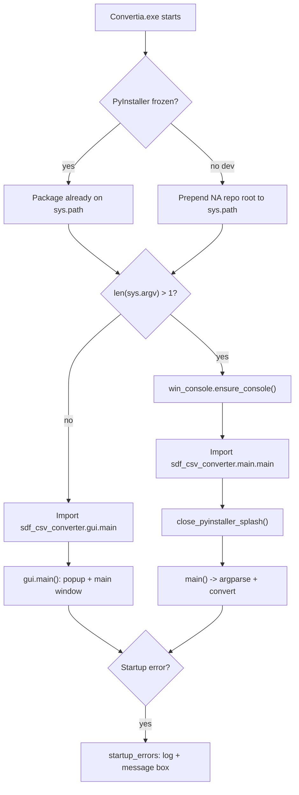
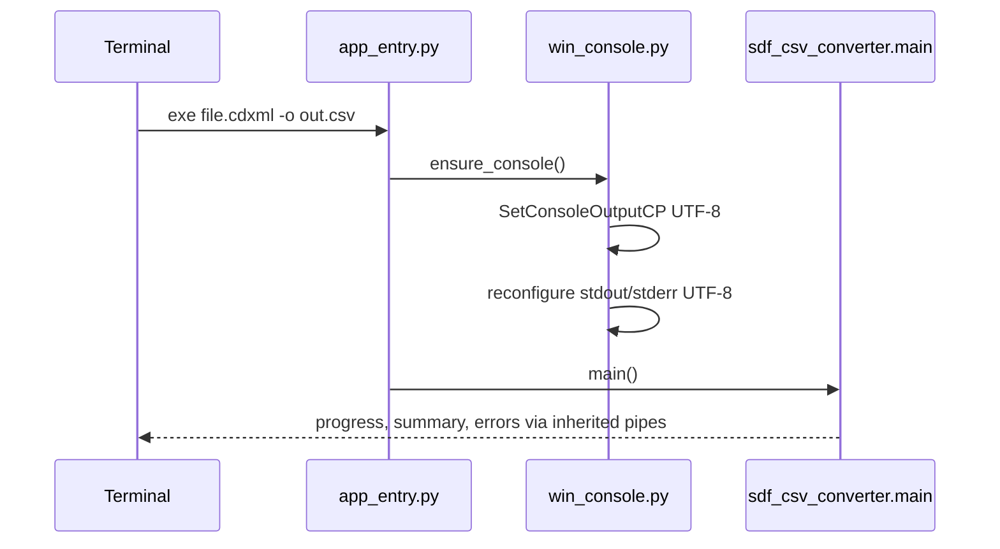
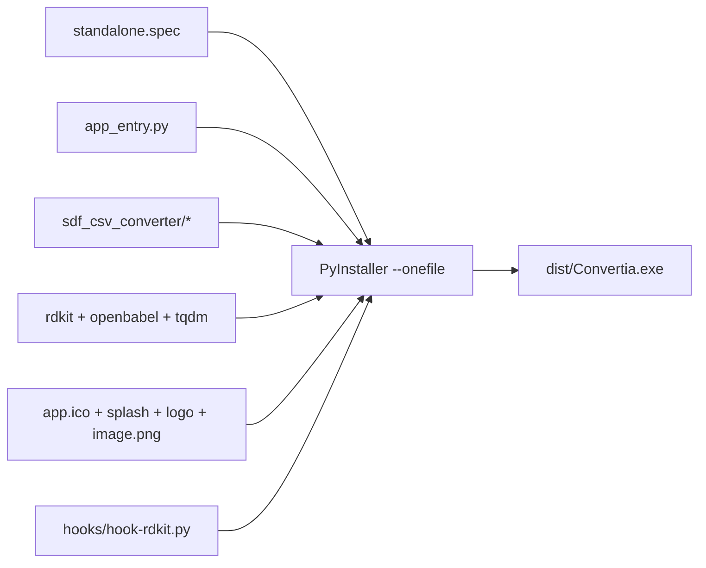
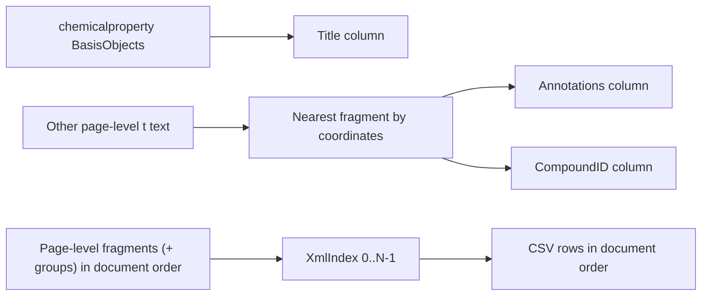

# Standalone packaging architecture

This document describes how the **combined single-file Windows executable**
(`dist/Convertia.exe`) is built and how it behaves at runtime. The
standalone layer is a thin packaging shell around the existing
[`sdf_csv_converter`](../sdf_csv_converter) package; it does not duplicate or
modify conversion logic.

---

## Goals

| Goal | How it is met |
|------|----------------|
| One portable `.exe` for end users | PyInstaller `--onefile` bundles CPython, RDKit, OpenBabel, and the converter package |
| Double-click opens GUI | Windowed subsystem (`console=False`) — no terminal flash |
| CLI redirect and piping work | Console subsystem inherits parent shell stdout/stderr; UTF-8 via `ensure_console()` |
| Same exe runs CLI from a terminal | `app_entry.py` dispatches on `sys.argv` |
| Do not fork the converter codebase | Imports `sdf_csv_converter.*` from the repo root via `pathex`; reuses `sdf_csv_converter/hooks/` |
| Polished desktop feel | Custom icon, splash, launch popup, modern tkinter GUI, startup error dialog |
| Reliable distribution | `startup_errors.py` logs failures; `DISTRIBUTION.md` covers sharing and SmartScreen |

---

## Repository layout

```
NA/
├── sdf_csv_converter/          # Core package (unchanged by standalone build)
│   ├── main.py                 # CLI: argparse + dispatch
│   ├── gui.py                  # GUI: tkinter window
│   ├── cdx_parser.py           # CDXML/CDX parsing
│   ├── hooks/hook-rdkit.py     # PyInstaller RDKit DLL hook (reused)
│   └── ...
└── standalone/                 # Packaging layer (this document)
    ├── app_entry.py            # Frozen entry point: GUI vs CLI
    ├── win_console.py          # Windows console attach + UTF-8 stdio
    ├── startup_errors.py       # Fatal startup log + message box (frozen)
    ├── generate_assets.py      # Build app.ico / splash / logo / image from Convertia.png
    ├── standalone.spec         # PyInstaller onefile spec
    ├── standalone_onedir.spec  # PyInstaller onedir spec (locked-down PCs)
    ├── version_info.txt        # Windows VSVersionInfo resource
    ├── build_standalone.py     # Clean + build + zip script
    ├── DISTRIBUTION.md         # How to share the exe with end users
    ├── assets/
    │   ├── app.ico             # Multi-resolution application icon
    │   ├── splash.png          # PyInstaller splash during unpack
    │   ├── logo.png            # GUI header image
    │   └── image.png           # Launch popup (also bundled in exe)
    └── dist/
        ├── Convertia.exe
        ├── image.png           # Optional external popup (also bundled)
        ├── README.txt            # Recipient quick-start
        └── Convertia.zip         # Recommended share package
```

---

## Runtime flow

### Launch dispatch



**Rules:**

- **No arguments** (typical double-click): import the GUI while the PyInstaller
  splash is visible, then run `gui.main()` (launch popup + main window). No
  console window is created (`console=False`). Splash closes when the Tk root
  is ready.
- **Any arguments** (terminal invocation): ensure UTF-8 console streams, run the
  CLI, then close the splash.
- **Startup failures** on the GUI path write `convertia_error.log` beside the exe
  and show a Windows message box (no silent exit).

### GUI (`sdf_csv_converter/gui.py`)

The desktop UI is a **tkinter** window with:

| Area | Behavior |
|------|----------|
| Input | Browse SDF, CSV, CDX, or CDXML |
| Output format | **CSV** or **SDF** radio buttons (explicit choice) |
| Output path | Browse save location; extension synced to selected format |
| Convert | High-contrast teal action button |
| Log | Dark terminal-style conversion output |

Conversion routing matches the CLI: input format from the file extension,
output format from the **radio selection** (not inferred only from the path).

### CLI console (Windows)

The exe uses PyInstaller's **windowed** bootloader (`console=False` in
`standalone.spec`), so double-clicking does not open a blank terminal. The CLI
path calls `ensure_console()` to attach to the parent shell or allocate a console,
so stdout/stderr redirection (`> file`, `2> log`) still works. `ensure_console()` additionally sets
the console code page and Python streams to UTF-8 so Unicode in help text and
the conversion summary (e.g. `→`) does not raise `UnicodeEncodeError` on legacy
cp1252 consoles.



On the **GUI** path no console is allocated (windowed subsystem). The legacy
``hide_console_window()`` helper remains for older console-subsystem builds.

---

## Build pipeline



### `standalone.spec` highlights

| Setting | Value | Rationale |
|---------|-------|-----------|
| `Analysis(..., pathex=[NA_ROOT, HERE])` | Repo root + standalone dir | Resolves `import sdf_csv_converter` without copying source |
| `hookspath=[sdf_csv_converter/hooks]` | Reuse existing RDKit hook | Avoid duplicating DLL collection logic |
| `collect_all("rdkit")` etc. | Bundles DLLs and data files | RDKit/OpenBabel need native libraries at runtime |
| `excludes` | matplotlib, scipy, pandas, Qt, jupyter, zmq | Smaller exe (~66 MB vs ~117 MB for legacy builds) |
| `console=False` | Windowed bootloader (`runw.exe`) | No terminal on double-click; CLI uses `ensure_console()` |
| `Splash(splash.png)` | Tcl/Tk splash during unpack | Masks onefile extraction delay for GUI users |
| `icon=app.ico`, `version=version_info.txt` | Explorer icon + Properties dialog | Desktop-app polish |

### Build command

```bash
cd standalone
python build_standalone.py
```

`build_standalone.py` deletes `build/` and `dist/`, runs
`python -m PyInstaller --noconfirm --clean standalone.spec`, and prints the
output path and size.

---

## Relationship to the core package

The standalone exe is **not** a fork. At runtime it calls the same functions as
the Python package:

| Mode | Entry | Core call |
|------|-------|-----------|
| GUI | `app_entry.run()` (no args) | `sdf_csv_converter.gui.main()` |
| CLI | `app_entry.run()` (with args) | `sdf_csv_converter.main.main()` |

All conversion paths (`sdf_to_csv`, `csv_to_sdf`, `cdx_to_csv`, `cdx_to_sdf`,
`cdx_parser`, `molecule_processor`, `clogp`) live in `sdf_csv_converter/` and are
documented in the main [README](../sdf_csv_converter/README.md) and the core
Architecture section there.

### Conversion fidelity (shared with all distributions)

The standalone exe does not implement parsing itself; it calls the same
`sdf_csv_converter` modules as `python -m sdf_csv_converter` and the legacy exes.



**Compound names:** ChemDraw links IUPAC captions to structures via
`chemicalproperty` / `ChemicalPropertyDisplayID` / `BasisObjects` (see
`_assign_titles_from_chemical_properties` in [`cdx_parser.py`](../sdf_csv_converter/cdx_parser.py)).

**Other free-text labels:** non-name page text is assigned per-structure by
coordinates (not duplicated to every row). See `_iter_page_structures` /
`_nearest_index`. Dense plates may still mis-associate non-name labels — check
`Annotations` and `CompoundID` in output.

**Structure ordering:** single-threaded CDX/CDXML parse; every row gets
`XmlIndex`; metadata columns first via `stream_utils.build_ordered_fieldnames`.
Locked by [`tests/test_cdx_table8.py`](../tests/test_cdx_table8.py).

### Comparison with legacy dual-exe builds

| Aspect | `standalone/dist/Convertia.exe` | `sdf_csv_converter/dist/*.exe` |
|--------|----------------------------------------|--------------------------------|
| Count | **One** combined exe | Two (CLI + GUI) |
| Subsystem | Console (`run.exe`); hidden on GUI path | CLI: console; GUI: windowed |
| Size | ~66 MB | ~117 MB each |
| CLI redirect (`> file`) | **Yes** | Yes (console exe only) |
| Splash | Yes | No |
| Icon + version metadata | Yes | No (unless added manually) |
| Modifies core package | No | No |

---

## Startup performance

PyInstaller **onefile** executables extract their embedded archive to a temp
directory on every launch. For this project that payload is large (CPython +
RDKit + OpenBabel), so:

- **First launch** after build or after temp cleanup can take several seconds.
- The **GUI splash** (`assets/splash.png`) is shown during extraction and import.
- **Subsequent launches** may be faster if the OS temp cache is warm.

An **onedir** build or a proper installer would remove extraction overhead but
was intentionally out of scope for the portable single-exe deliverable.

---

## Rebranding and versioning

| Asset | File | Effect |
|-------|------|--------|
| Application icon | `assets/app.ico` | Explorer, taskbar, file Properties |
| Splash image | `assets/splash.png` | PyInstaller splash during unpack |
| Launch popup | `assets/image.png` (bundled + optional beside exe) | Shown at GUI start |
| GUI header | `assets/logo.png` | Main window branding |
| Version strings | `version_info.txt` | Windows file Properties (Product version, Company, etc.) |
| Package version | `sdf_csv_converter/__init__.py` | `--version` CLI output; keep `version_info.txt` in sync |

After changing any asset, rebuild with `python build_standalone.py --zip`.
See **[DISTRIBUTION.md](DISTRIBUTION.md)** for sharing `Convertia.zip` with end users.

---

## Dependencies (build-time only)

| Package | Role |
|---------|------|
| `pyinstaller` | Bundles Python app into `.exe` |
| `pillow` | Generates/resizes `app.ico` from source artwork (optional after initial assets exist) |
| `rdkit`, `openbabel`, `tqdm` | Runtime deps collected into the exe (must be installed in the build environment) |

---

## License

- **This repository’s code** (including `standalone/` launcher scripts): [MIT License](../LICENSE).
- **Bundled executables**: see [THIRD_PARTY_NOTICES.md](../THIRD_PARTY_NOTICES.md) (RDKit BSD, OpenBabel GPL v2 when included, Python PSF, etc.).
